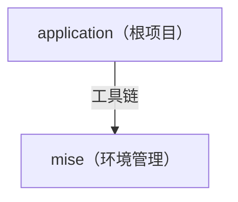

# application

## 概览

- 用途：框架
- 状态：工具链

## 架构



## 结构

```text
.
├── .editorconfig     # 代码风格
├── .gitattributes    # Git 属性
├── .gitignore        # Git 忽略
├── mise.toml         # 开发环境
└── README.md         # 项目说明
```
