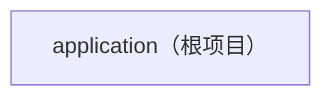

# application

## 概览

- 用途：框架
- 状态：初始化

## 架构


```mermaid
flowchart TD
    application["application（根项目）"]
```

## 结构

```text
.
├── .editorconfig     # 代码风格
├── .gitattributes    # Git 属性
├── .gitignore        # Git 忽略
└── README.md         # 项目说明
```
