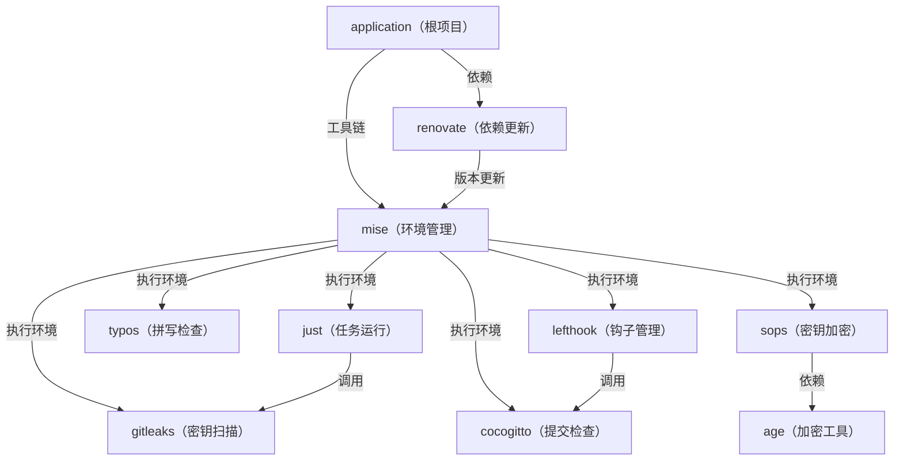

# application

## 概览

- 用途：框架
- 状态：工具链

## 架构



## 结构

```text
.
├── .editorconfig     # 代码风格
├── .gitattributes    # Git 属性
├── .gitignore        # Git 忽略
├── .gitleaks.toml    # 密钥扫描
├── .sops.yaml        # 密钥加密
├── .typos.toml       # 拼写检查
├── cog.toml          # 提交检查
├── justfile          # 任务运行
├── lefthook.yaml     # 钩子管理
├── mise.lock         # 工具版本
├── mise.toml         # 开发环境
├── renovate.json5    # 依赖更新
└── README.md         # 项目说明
```
